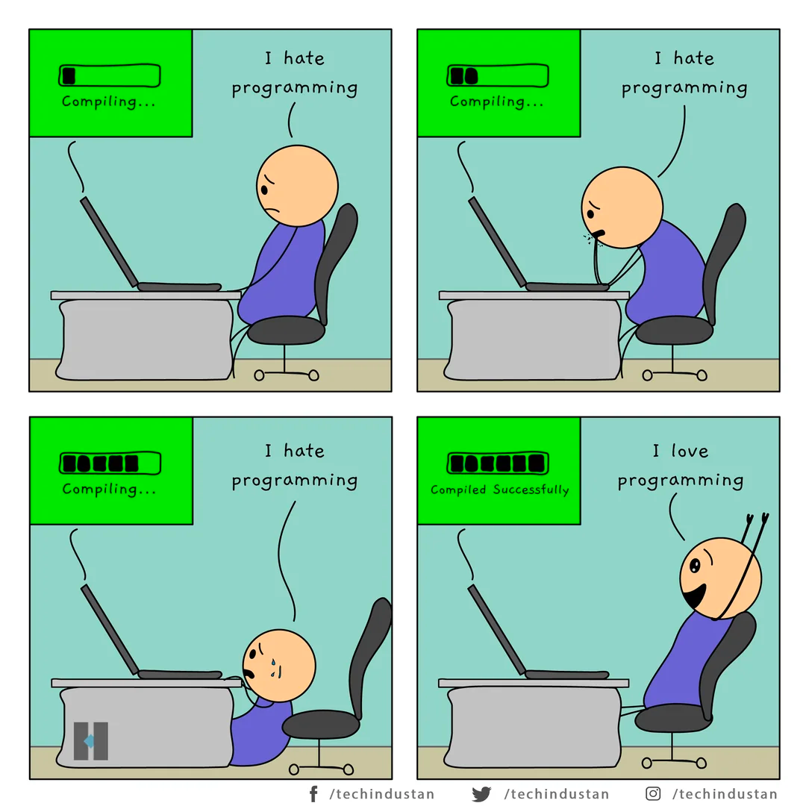

# How to make faster the SAM CLI tool with Maven?


<div style="text-align:center">
  <a href="https://copyright-link.example.com" target="_blank">
    
  </a>
</div>

In today's fast-paced software development landscape, every second counts. The need for speed and efficiency has made it crucial to find a ways to execute faster Continuous Integration/Continuous Deployment (CI/CD) tools that can quickly build code and provision infrastructure, especially when Software Engineers manage their code individually.

As an example, AWS SAM CLI is the command line tool that you can use with AWS SAM templates and supported third-party integrations to build and run your serverless applications. And below, tips & tricks for AWS SAM CLI explained using Maven build automation tool under the hood to work with the Java projects.

The article was inspired by advices from [Thibault Faure](https://www.baeldung.com/maven-fast-build "How to Speed Up Maven Build")and my personal experience while developing multi-module projects by SAM and Java.

## Optimize Maven executed by AWS SAM CLI

### Skip tests

Of course, I believe that you have a good test coverage for your project, but sometimes you need to skip tests to make faster the build process. For example, if you have a lot of integration tests that require a lot of time to run, you can skip them by addding the environment variable to the build command:

```bash
MAVEN_OPTS="-Dmaven.test.skip=true" sam build
```

Less efficient will be to use `-DskipTests` option, because it will compile the tests, but will not run them. So, why do we need to waste a time to compile the tests if we are not going to run them, huh?

### Enable parallel builds in Maven

Leverage Maven's parallel execution feature by adding the following Maven's environment variable:

```bash
MAVEN_OPTS="-T4" sam build
```

This will run four threads to build different Maven modules concurrently.

### Turn off Internet access for Maven

Once you have downloaded all the depenencies and other resources, there is no need to check them remotely:

```bash
MAVEN_OPTS="--offline" sam build
```

### Use Maven Daemon instead of usual mvn command

The Maven daemon aims at improving Maven builds' velocity. The daemon is a long-lived background process that remains active even after the build completes. It reduces build overhead by keeping essential components in memory, enabling faster project builds by avoiding repeated startup and initialization processes. To install it, we can follow the instructions on the [GitHub](https://github.com/apache/maven-mvnd) page of the project. Once you have installed it, modify invocation of `sam build`:

```bash
TBD
```

## Optimize AWS SAM CLI itself

### Reuse build artifacts from the previous executions

Utilize the --cached option with SAM build to reuse build artifacts from previous builds, which can speed up the process significantly:

```bash
sam build --cached
```

### Enable parallel builds in SAM

Use this option to build your AWS SAM template's functions and layers in parallel. By default, the functions and layers are built in sequence.

```bash
sam build --parallel
```

## Conclusion

If you merge all aforementioned advices, you will get the following command to build and deploy Java applications built by Maven and deployed by SAM templates:

```bash
MAVEN_OPTS="-Dmaven.test.skip=true -T4 --offline" sam build --cached --parallel && \
sam deploy
```
